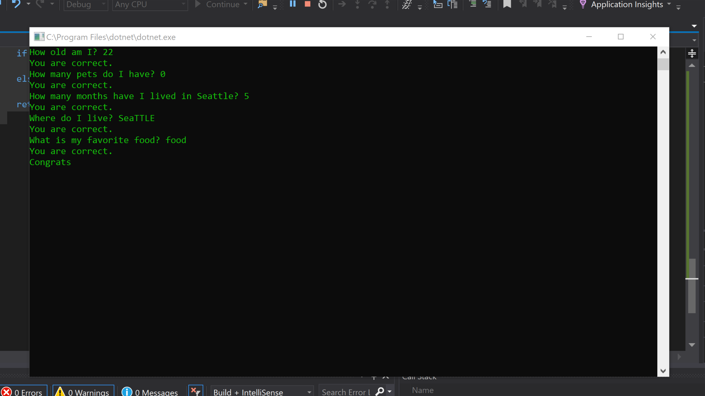

# Lab01-AboutMeQuiz
# What is the purpose of the program?
This program is a Console-based. It asks a series of five questions and returns if you got the answer correct or not. 
# How to run
To run in Visual Studio 2017, load the project program open the code file Project.cs then press Ctrl+F5 to compile and run without debug.
# ScreenShot

